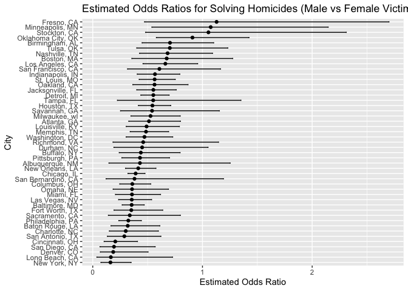
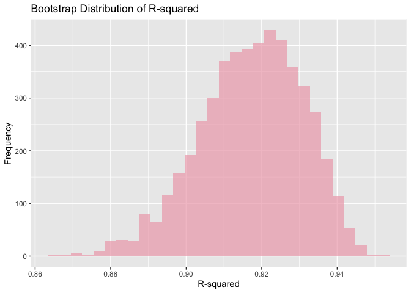
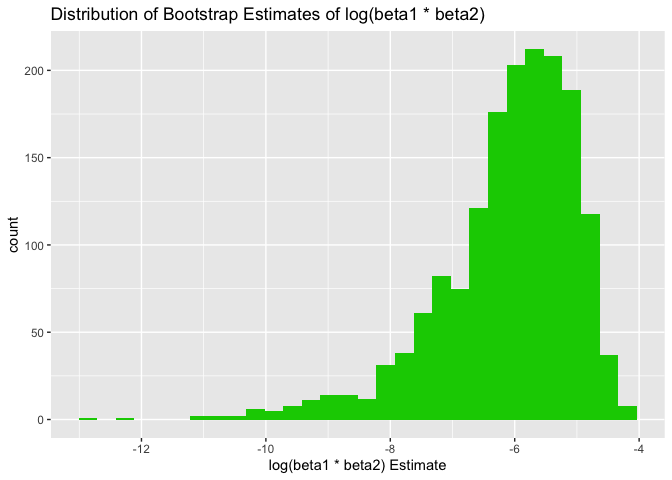

p8105_hw6_bac2214
================
Brianna Carnagie
2023-11-28

## Question 1

In this first step, here is what I did:

- A city_state variable was created.
- A binary variable homicide_solved was added to indicate whether the
  homicide is solved.
- Homicides from the cities Dallas, TX; Phoenix, AZ; Kansas City, MO
  were omitted.
- The analysis was limited to cases where victim_race is white or black.
- victim_age was converted to a numeric format (and non-numeric values
  were coerced into NAs).

``` r
homicide_df = read_csv("data/homicide-data.csv") |> 
   mutate(
    city_state = paste(city, state, sep = ", "),
    homicide_solved = ifelse(grepl("closed", disposition, ignore.case = TRUE), 1, 0)
  ) |> 
  filter(!city_state %in% c("Dallas, TX", "Phoenix, AZ", "Kansas City, MO", "Tulsa, AL")) %>%
  filter(victim_race %in% c("White", "Black")) |> 
  mutate(victim_age = as.numeric(victim_age))
```

    ## Warning: There was 1 warning in `mutate()`.
    ## ℹ In argument: `victim_age = as.numeric(victim_age)`.
    ## Caused by warning:
    ## ! NAs introduced by coercion

In the next step, I attempt to make the log regression for Baltimore, MD
and obtain the estimate and confidence interval of the adjusted odds
ratio for solving homicides comparing male victims to female victims
keeping all other variables fixed.

``` r
baltimore_df = filter(homicide_df, city_state == "Baltimore, MD")

baltimore_log_model = glm(homicide_solved ~ victim_age + victim_sex + victim_race, 
                       data = baltimore_df, family = binomial())

baltimore_log_model |> 
  broom::tidy() |> 
  mutate(
    OR = exp(estimate),
    CI_lower = exp(estimate - 1.96 * std.error),
    CI_upper = exp(estimate + 1.96 * std.error)
  ) |> 
  select(term, OR, CI_lower, CI_upper) |> 
  knitr::kable(digits = 3)
```

| term             |    OR | CI_lower | CI_upper |
|:-----------------|------:|---------:|---------:|
| (Intercept)      | 1.942 |    1.380 |    2.734 |
| victim_age       | 0.995 |    0.988 |    1.001 |
| victim_sexMale   | 0.355 |    0.268 |    0.469 |
| victim_raceWhite | 2.459 |    1.727 |    3.501 |

**Key findings:**

- Intercept *(not interpretable)*: The odds of a homicide being solved
  when the victim is a 0-years old, black female is 1.92.
- For every one year increase in age, we expect the odds of their
  homicide being solved to decrease by 0.995
- The odds of a male victim having their homicide solved is 0.355 times
  the odds of a women having their homicide solved, holding all other
  factors constant.
- Being white significantly increases the odds of their homicide being
  solved, compared to being black.
- Victim age does not appear to be a significant predictor at the common
  0.05 significance level (p\>0.05).

Here I iterate the process to run a glm for all cities in my dataset:

``` r
fit_glm_OR = function(df) {
  model = glm(homicide_solved ~ victim_age + victim_sex + victim_race, 
               data = df, 
               family = binomial())
  
  tidy_model = broom::tidy(model) |> 
    mutate(
      OR = exp(estimate),
      CI_lower = exp(estimate - 1.96 * std.error),
      CI_upper = exp(estimate + 1.96 * std.error)
    ) |> 
    filter(term == "victim_sexMale") |> 
    select(term, OR, CI_lower, CI_upper)
  return(tidy_model)
}

cities_OR_CI <- homicide_df %>%
  split(.$city_state) %>%
  map_dfr(fit_glm_OR, .id = "city_state")
```

Here’s a plot:

``` r
ggplot(cities_OR_CI, aes(x = reorder(city_state, OR), y = OR)) +
  geom_point() +
  geom_errorbar(aes(ymin = CI_lower, ymax = CI_upper), width = 0.2) +
  coord_flip() +  # Flips the axes for horizontal orientation
  labs(title = "Estimated Odds Ratios for Solving Homicides (Male vs Female Victims)",
       x = "City",
       y = "Estimated Odds Ratio")
```

<!-- -->

Fresno has the highest odds of solving homicides comparing male victims
to female victims, while New York has the lowest odds. Fresno has a
really wide CI, indicating greater variability in the data.

## Question 2

``` r
weather_df = 
  rnoaa::meteo_pull_monitors(
    c("USW00094728"),
    var = c("PRCP", "TMIN", "TMAX"), 
    date_min = "2022-01-01",
    date_max = "2022-12-31") |>
  mutate(
    name = recode(id, USW00094728 = "CentralPark_NY"),
    tmin = tmin / 10,
    tmax = tmax / 10) |>
  select(name, id, everything())

suppressWarnings({
bootstrap_function <- function(data) {
  model <- lm(tmax ~ tmin + prcp, data = data)
  r_squared <- broom::glance(model)$r.squared
  log_beta_product <- log(broom::tidy(model)[2, "estimate"] * broom::tidy(model)[3, "estimate"])
  return(data.frame(r_squared = r_squared, log_beta_product = log_beta_product))
}

set.seed(123)  
bootstrap_estimates <- replicate(5000, sample_n(weather_df, size = n(), replace = TRUE), simplify = FALSE) %>%
  map_dfr(bootstrap_function) 
})
```

Here are some plots:

``` r
ggplot(bootstrap_estimates, aes(x = r_squared)) +
  geom_histogram( fill = "pink2", alpha = 0.7) +
  labs(title = "Bootstrap Distribution of R-squared", x = "R-squared", y = "Frequency")
```

    ## `stat_bin()` using `bins = 30`. Pick better value with `binwidth`.

<!-- -->

``` r
ggplot(bootstrap_estimates, aes(x = estimate)) +
  geom_histogram(fill = "green3") +
  labs(title = "Distribution of Bootstrap Estimates of log(beta1 * beta2)",
       x = "log(beta1 * beta2) Estimate")
```

    ## `stat_bin()` using `bins = 30`. Pick better value with `binwidth`.

    ## Warning: Removed 3363 rows containing non-finite values (`stat_bin()`).

<!-- -->

``` r
r_squared_ci <- quantile(bootstrap_estimates$r_squared, probs = c(0.025, 0.975))
log_beta_product_ci <- quantile(bootstrap_estimates$estimate, probs = c(0.025, 0.975), na.rm = TRUE)

print(r_squared_ci)
```

    ##      2.5%     97.5% 
    ## 0.8882079 0.9402552

``` r
print(log_beta_product_ci)
```

    ##      2.5%     97.5% 
    ## -9.063214 -4.619267

The Bootstrap Distribution of R-squared is slightly right-skewed while
the Bootstrap Distribution of log(beta1 \* beta2) is skewed right
significantly. The CI for r_squared is 0.89 to 0.94, and the CI for
log(beta1 \* beta2) is -9.06 to -4.62.

## Question 3
